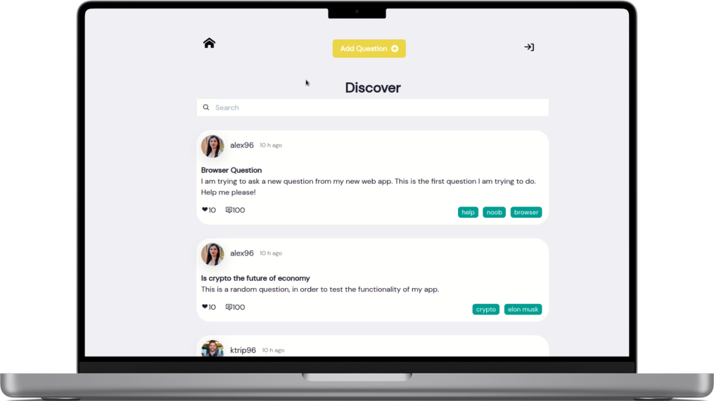
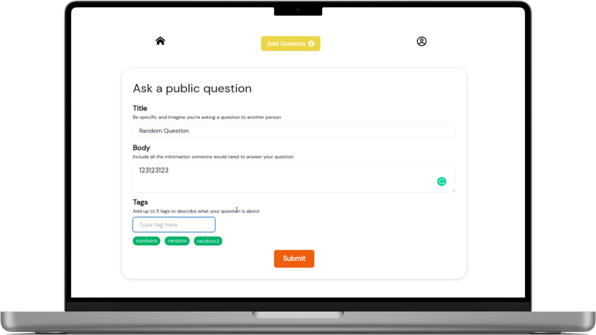
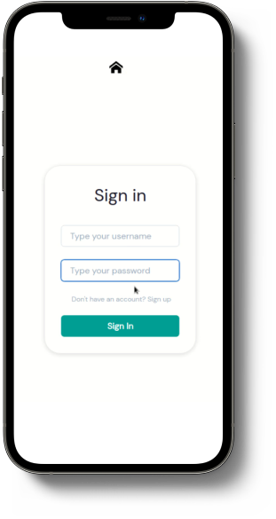

# QnA project 💻
## Team project for "Software as a Service" course 

#### Description :speech_balloon:: 
The main purpose of the project, was to build a platform, in which the users can make questions and get answers.
Somethink like Stackoverflow, Quora etc. There is a main page with the question feed, and a home page, that only registered and logged in users have access to.
In the main page, the user can see his questions / answers and can edit his profile.
We use user authentication with JWT token through cookies.





#### To run locally ⚙️:
clone the project repo

```
git clone
npm -i
cd server
npm run dev
cd client
npm start
```

> **username** 🧔: ktrip96
> 
> **password** 🔑: 123456

#### Technologies Used:
- **front end**:
React JS

- **backend**:
Node JS

- **database**:
MongoDb

